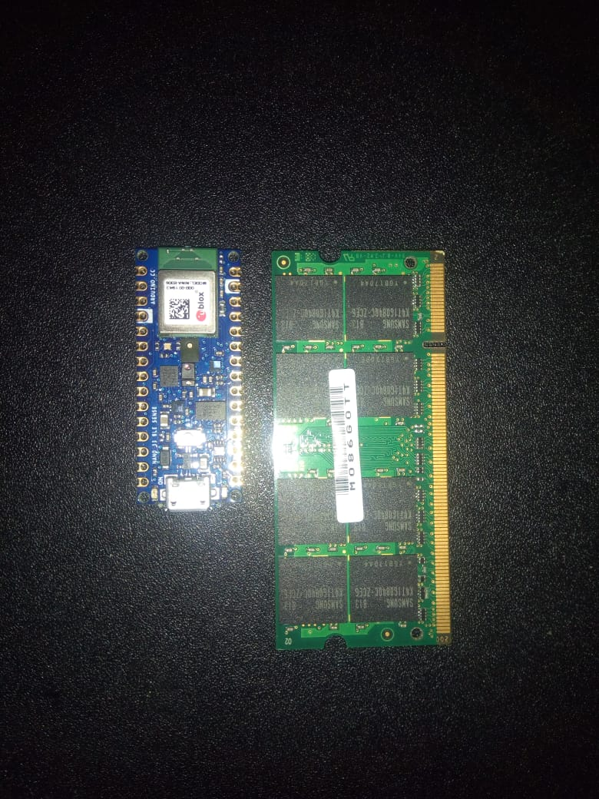

# nano-33-ble-sense
Collecting arduino nano 33 ble sense sensors data using arduino IDE

# Getting started

Nano? Yes "nano" or tiny. Arduino nano 33 ble sense is a small thumb-sized rapid prototyping board, thrice less than a toshiba 2gb ram card. Its design is higly meant to conserve power at the same time be cost effective. It can best suit prototyping solution using Bluetooth Low Energy (BLE) protocol. It is based on a NINA B306 module, that hosts a Nordic nRF52480 that contains a Cortex M4F microcontroller. It has a set of sensors, including IMU/LSM9DS1, digital microphone/MP34DT05, gesture sensor/APDS9960, barometer sensor/LPS22HB, relative humidity and temperature sensor/HTS221, all made my STMicroelectronics. You can hack and code on the move since the board can fit in the allet or pocket "mobile weather station". Arduino 33 ble sense is programmed in C/C++ using the Arduino Software (IDE). There exists an online version and and offline.

# Installation and configuration of IDE
## Arduino Web IDE

