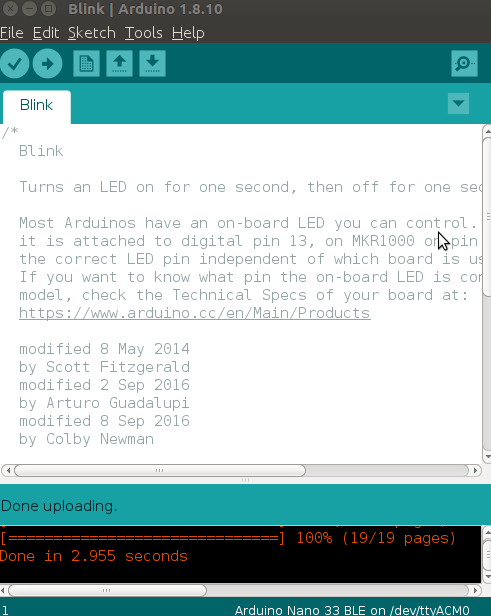
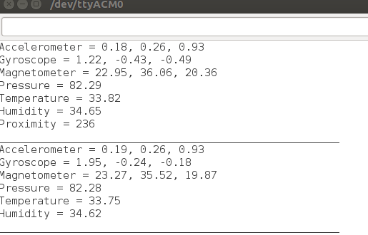
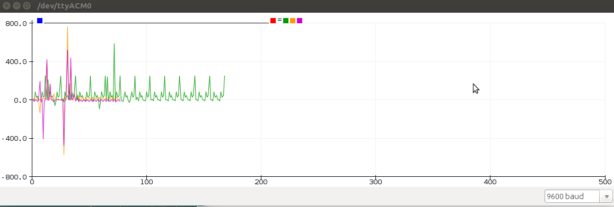

# Arduino Nano 33 BLE Sense

Collecting Arduino Nano 33 BLE Sense sensors data using arduino IDE. This repository relies on [arduino guide](https://www.arduino.cc/en/Guide/NANO33BLESense) 

# Getting started

Nano? Yes "nano" or tiny. Arduino Nano 33 BLE Sense is a small, thumb-sized, rapid-prototyping board, thrice less the size of toshiba 2gb ram card. Its design is higly meant to conserve power at the same time be cost effective. It can best suit prototyping solution involving Bluetooth Low Energy (BLE). It is based on a NINA B306 module, that hosts a Nordic nRF52480 that contains a Cortex M4F microcontroller. The board is an improvement of ar Arduino Nano 33 BLE, and both are recognised the same way in arduino IDEs (dont be worried). It has a set of sensors. They include IMU/LSM9DS1, digital microphone/MP34DT05, gesture sensor/APDS9960, barometer sensor/LPS22HB, relative humidity and temperature sensor/HTS221, all made my STMicroelectronics. You can do IoT hackathons on the move since the board can fit in a wallet or pocket. How about "mobile weather station?". You can make a small weather station. Arduino Nano 33 BLE Sense is programmed in C/C++ using the Arduino Software (IDE). There exists an online IDE version and and offline desktop IDE.

# Arduino IDE installation and configuration
## Arduino Web IDE

This IDE configuration does not need any downloads. Go to [getting started with arduino web IDE](https://auth.arduino.cc/login/?challenge=eyJhbGciOiJSUzI1NiIsInR5cCI6IkpXVCJ9.eyJhdWQiOiJjcmVhdGUiLCJleHAiOjE1NzkxNTk0MDUsImp0aSI6ImEwYTM1YWM4LWRjYzYtNDI4OC04NWUxLWIxMDRmNTg4MjMxZSIsInJlZGlyIjoiaHR0cHM6Ly9oeWRyYS5hcmR1aW5vLmNjL29hdXRoMi9hdXRoP2NsaWVudF9pZD1jcmVhdGVcdTAwMjZzdGF0ZT00ZHdoc3Vlc1x1MDAyNnNjb3BlPXByb2ZpbGU6Y29yZSUyMHByb2ZpbGU6Y29udGFjdCUyMHByb2ZpbGU6cHVibGljJTIwY3JlYXRlOnVzZXJzJTIwY3JlYXRlOnNrZXRjaGVzJTIwY3JlYXRlOmZpbGVzJTIwY3JlYXRlOmxpYnJhcmllcyUyMGNyZWF0ZTpjb21waWxlJTIwaW90OmRldmljZXMlMjBwcm9maWxlOmFkZHJlc3MlMjBwcm9maWxlOnByaXZhdGVcdTAwMjZyZXNwb25zZV90eXBlPXRva2VuXHUwMDI2cmVkaXJlY3RfdXJpPWh0dHBzJTNBJTJGJTJGY3JlYXRlLmFyZHVpbm8uY2MiLCJzY3AiOlsicHJvZmlsZTpjb3JlIiwicHJvZmlsZTpjb250YWN0IiwicHJvZmlsZTpwdWJsaWMiLCJjcmVhdGU6dXNlcnMiLCJjcmVhdGU6c2tldGNoZXMiLCJjcmVhdGU6ZmlsZXMiLCJjcmVhdGU6bGlicmFyaWVzIiwiY3JlYXRlOmNvbXBpbGUiLCJpb3Q6ZGV2aWNlcyIsInByb2ZpbGU6YWRkcmVzcyIsInByb2ZpbGU6cHJpdmF0ZSJdfQ.EHNCuj-RqBLzlSFULPtHcd9OdzfPmcqAolZ6xokdPhbnfwoVJPfR7-5UasDIeWv_8E6nJxqKXncbVRarVgj1WldiI7imSxyKmTJkOn37LlyVYc-Y-Owu0ad9zl1dxTFKt-Y6Xn15HcdJGG-NMPw8alrBbF_kzh8gi7dqfzYbPmSVM1kYCRbYCeJWKJF_6YroX6lxIv1GB2E9feLaUvg4So_xRNCk9XTFv-9Nf6xJIYY91n24ibbejzN1lThwooLnVvoix1-kH-Tc6noUhCl40LuSGWWfE-lflHqfkMOypvu3onr8TWjHblCZH7-6e7Mn43ZtuowuZrqljmowwJrgznwr8-X7tdGP7TS0KRiKphoRnVc29koDPmRxVid7REUn9RisEroCs1ZLGQGhVsvwsSjUCiMgJUSm6FU1aCkXF66X0Pc0zjBjkaT7J2GDxYbihICvuvgTNGOm4yDjtCZiK3oF7jl4tKj4Po0_vgxgTM1f0Of-Jh_mtVnLA5REq3praHDIzXDrnEvFTJmpXKmg77CVEL9BUuF_jNQkvOjjYTEhJiZRaf_tbCZOHalXf5AgJRvTHagZdHBKOw4UuD4QeV-R1aosHjRWSIECoeE05sLl1s7ZxMcHGOO0PhD4BNEbPsljIXcKJ1zLI_3Dj7nzC3atlvISq9QrodVILZZfeTI), create an account, login, and you are good to go. The IDE is hosted online so its up to date in terms of libraries and drivers.

# Arduino Desktop IDE

This IDE needs to be downloaded to your PC, and get configured before use. This is when you need to program your arduino offline. Go to [arduino desktop IDE](https://www.arduino.cc/en/Main/Software) page, scroll down and choose the version for your operating system and download. You will be directed to another page pronting you to donate, click Just download. On windows, [install this way](https://www.arduino.cc/en/guide/windows) if you got trouble. If you are  using Derbian/ubuntu or linux, go to the directory you downloaded the zipped file, extract, navigate to the extracted folder on the terminal where *install.sh* file lives. Install arduino desktop IDE by running the command **./install.sh** or **sudo ./install.sh**. You may need sudo rights. Wait untill its finished. An icon will be created on the desktop. Check [installation on linux](https://www.arduino.cc/en/guide/linux) if you need more information. Connect the arduino nano 33 ble sense using USB to your computer. 

Add the Arduino nRF528x mbed Core by going to Tools menu, then Boards and lastly Boards Manager. Search for the Mbed and install. Be doing something else since this process may take some time. The core contains alot of files. Check on tools, then Boards if it is stated there.

# Install drivers 
## Windows (tested on 7, 8 and 10)

If you properly installed the nRF528x mbed Core, just connect the Arduino NANO 33 BLE Sense to your computer with a USB cable. Windows should initiate its driver installation process once the board is plugged in.

## Linux

No driver installation is necessary for Linux.
Note for Raspberry Pi users: the Linux Arm version of IDE with Mbed OS core 1.1.2 may show an error while compiling for this board. We are aware of the issue and we are updating the toolchain.

## OSX

No driver installation is necessary on OSX. Depending on the version of the OS you're running, you may get a dialog box asking you if you wish to open the “Network Preferences”. Click the "Network Preferences..." button, then click "Apply". The Arduino NANO 33 BLE Sense will show up as “Not Configured”, but it is still working. You can quit the System Preferences.

# Choose the board and port

Go to Tools, then Boards, and lastly select Arduino Nano 33 BLE. To select a port go to Tools, Serial Ports and select the Port. In case you are using Ubuntu and you have problems selecting the ports, these two commands helped me alot in read write rights;

**sudo usermod -a -G dialout username**
**sudo chmod a+rw /dev/ttyACM**

# Test installation and configuration

After installations and configuration, go to Files, then Examples, Basics, lastly Blink. Click right pointing arrow to upload, and if everything is okay, you'll see a window like the one below. That shows your installation was good.

# Programming.

Write a program to collect all sensors data from the Arduino Nano 33 BLE Sense except microphone sensor. All libraries are needed. Go to Sketch, include libraries, then Manage libraries. Search and install all the sensor libraries; LSM9DS1, LPS22HB, HTS221, APDS9960. **NOTE:** I did not use the microphone sensor.

Use nano sketch in this repository to collect the sensor data. Ensure the baud rate is set to 9600. Upon uploading turn to Tools, then Serial monitor to visualize your sensors data. Incase of any errors, press the white button once to refresh or unplug and plug back the board. Data is visualized as below.

You can as well use serial plotter to plot as below

.

Thank you, Enjoy Collecting data.

